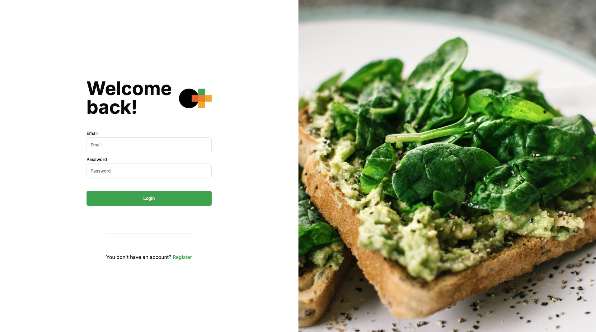
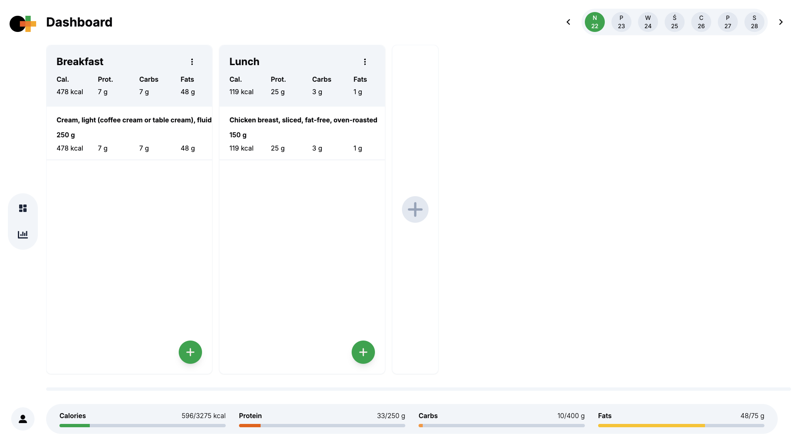
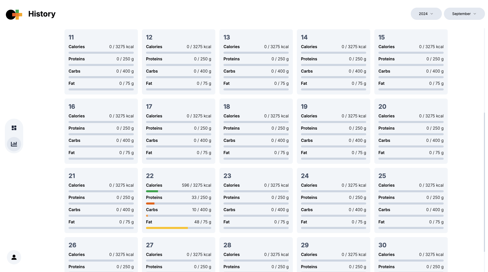

This project is a calorie tracker app built with Next.js. The app allows users to log their daily meals, track their calorie intake, and monitor their nutritional goals. It’s designed to help users maintain a healthy diet by keeping track of what they eat.

Features

- User Authentication.
- Meal Logging: Add meals with details like calories, macronutrients (protein, fats, carbs), and serving size.
- Daily Calorie Goal: Set daily calorie goals and monitor progress.
- Nutrient Breakdown: Get a detailed breakdown of daily nutrient intake (calories, protein, fat, carbs).
- Progress Tracking: Viev monthly chart showing caloric intake over time.

## Running the application

Run the development server:

```
npm run dev
```

## Screenshots

### Login Page



### Dashboard



### History


